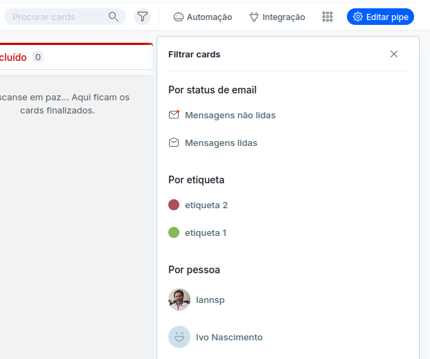

# Search Beyond the Basics. (part 1)
### How can you improve the search and find what you want.

---
   Este artigo faz parte de uma série sobre recursos da plataforma Pipefy e como integrar o Pipefy em sua aplicação utilizando o pacote [Clientedigital/Pipefy](https://github.com/cliente-digital/pipefy)

tags: #pipefy #integração #php #clientedigital #workflow #bpm #search

---
Como um [Citzen Developer](https://www.pipefy.com/blog/what-is-a-citizen-developer/) que se preza, você já notou que a busca do Pipefy pesquisa por campos de formularios iniciais ou formulários de fase, mas você sabe quais campos são pesquisados com quando voce digita algo em procurar cards?

Um bom primeiro passo para entender a busca do app do pipefy é olhar para sua API. A API do pipefy é baseada em [graphql](https://graphql.org/) e sua [documentação](https://api-docs.pipefy.com/reference/inputObjects/CardSearch/#) cobre todos os seus componentes e o seu ponto fraco esta nos detalhes. Alguns recursos deveriam ser detalhados para cobrir seu escopo e entre esses recursos esta a busca por card.

Vamos a um primeiro exemplo, a  [query cards](https://api-docs.pipefy.com/reference/queries/cards/#cards).

```graphql
query{
  cards(pipe_id: _PIPEID_ , first:50 _SEARCH_ ) {
    edges {
      node {
        id
        title
        }
      }
    }
  }
```
Essa query busca por cards em um pipe especifico( \_PIPEID\_ ), utilizando parametros de busca ( \_SEARCH\_ ) e retona os campos id e title de todos os cards(que são nodes) que atendem aos parametros de busca \SEARCH\_.

Você pode executar sua busca no [app de graphql](https://app.pipefy.com/graphiql) para ver o resultado. Para saber o id do seu pipe [acesse o pipe](https://app.pipefy.com/) e pegue o id que aparece na url https://app.pipefy.com/pipes/[id].

por exemplo, se o número do [id] for 999999999

```graphql
query{
  cards(pipe_id: 999999999 , first:50  ) {
    edges {
      node {
        id
        title
        }
      }
    }
  }
```
Não se preocupe com o parametro \_SEARCH\_. Ele é opcional e iremos falar dele daqui a pouco.

e o resultado sera:

```graphiql
{
  "data": {
    "cards": {
      "edges": [
        {
          "node": {
            "id": "968095899",
            "title": "Card 1"
          }
        },
        {
          "node": {
            "id": "968096399",
            "title": "Card 2"
          }
        },
        {
          "node": {
            "id": "968096799",
            "title": "Card 3"
          }
        }
      ]
    }
  }
}
```

Agora vamos falar do parametro \_SEARCH\_. Ele é do tipo [CardSearch](https://api-docs.pipefy.com/reference/inputObjects/CardSearch/) e tem os seguintes campos:

- assignee_ids: [ID]
- ignore_ids: [ID]
- labels_ids: [ID]
- title: String
- search_strategy: [CardSearchStrategy](https://api-docs.pipefy.com/reference/enums/CardSearchStrategy)
- include_done: Boolean
inbox_emails_read: Boolean

Você não precisa utilizar todos os campos do CardSearch. Então vamos pesquisar por title:

```graphql
query{
  cards(pipe_id: 999999999 , first:50,  search: {title:"Card 3"} ) {
    edges {
      node {
        id
        title
        }
      }
    }
  }
```
que retorna:
```graphiql
{
  "data": {
    "cards": {
      "edges": [
        {
          "node": {
            "id": "968096799",
            "title": "Card 3"
          }
        }
      ]
    }
  }
}
```


Esta na hora de ligar os pontos, ou melhor, ligar a graphql cards que acabamos de conhecer e a pesquisa no app.



Quando você digita um valor no campo "Procurar cards" você esta pesquisando pelo título do card(search: ```{title:"Card 3"}```).

Quando pesquisa por status de email esta utilizando ```inbox_emails_read```. Por etiqueta ```labels_ids```. Por pessoa ```assignee_ids```.

O App da pipefy utilizar a query cards e e como essa query não pesquisa por campos do card você também não consegue pesquisar por campos do card no app.

Eu não acho que isso é um problema. Ao limitar os recursos de busca(incidentalmente ou não) o app força o usuario a manter uma estrutura mais forte de etiquetas e acredito que uma boa taxonomia de tags é a melhor maneira de encontrar o que você quer.

Um bom artigo sobre o tema é [What we learned from creating a tagging taxonomy](https://dovetail.com/blog/what-we-learned-creating-tagging-taxonomy/) da dovetail.
